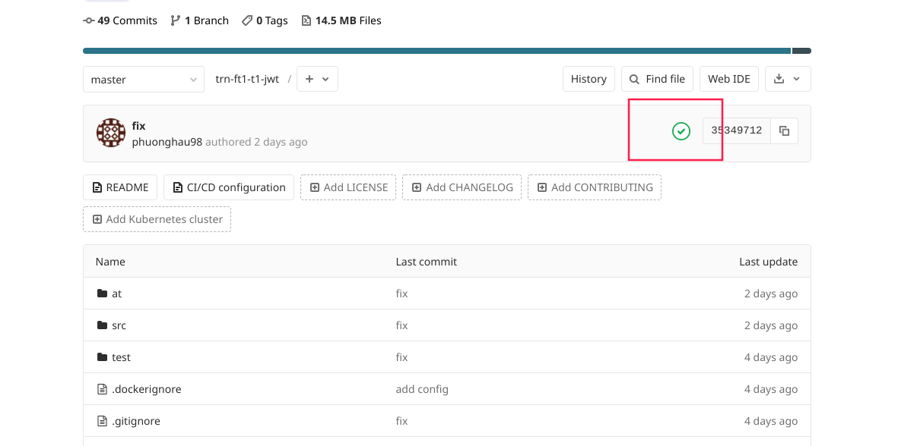

## Hướng dẫn thực hiện test

1. Với mỗi folder test, gười dùng sẽ phải tạo từng project trên git.digihcs.vn tương ứng, set private.
2. Đối với mỗi bài test sẽ có cấu hình khác nhau, kiểm tra cấu hình qua file _.env_.
3. Điền đúng tên username (theo trang room.digihcs.com) trong file _.env_.
4. Đọc kĩ yêu cầu theo từng bài test.
5. Khi submit chỉ cần commit code lên git, test sẽ tự chạy. Nếu chạy thành công, sẽ tự động thêm vào file kết quả, xem tại [đây](http://training.phuonghau.com/)

Success example

  

