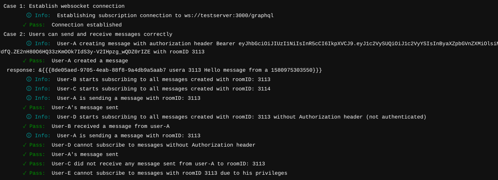

## Mục tiêu của bài test
1. Nắm được cách thực hiện Subscription trên của apollo graphql trên graphql
2. Authenticate được websocket connection trong lúc client và server đang thực hiện handshake
3. Authorise người dùng dựa trên token và đưa vào được context để thực hiện filter
## Mô tả
Bạn sẽ phải xây dựng một ứng dụng chat đơn giản trong đó người dùng có thể gửi và nhận tin nhắn theo thời gian thực sử dụng GraphQL.
### GraphQL Object Type
```
type Message {
  _id: ID
  createdBy: String
  roomID: String
  content: String
  createdAt: Float
}

type Subscription {
  chat(roomID: String!): Message
}

type Mutation {
  createMessage(message: MessageInput): Message
}

type Subscription {
  messageCreated(roomID: String!): Message
}

input MessageInput {
  content: String!
  roomID: String!
}
```

### Đối tượng người dùng
Có 5 đối tượng người dùng như sau: *user-A*, *user-B*, *user-C*, *user-D* và *user-E*
Tất cả các user trên đều có token (ngoại trừ user-D) với object được hash (với secret key là sup3rs3c) dưới dạng sau:
```
{
  userID: string
  privileges: string[]
}
```
với **userID** là user của người đó và **privileges** ở đây được hiểu là quyền của user (**lưu ý là trong bài test để đơn giản ta mới lưu quyền của người dùng vào token ở phía client, trong thực tế thì ta sẽ lưu quyền của người dùng vào database, và truy vấn quyền này mỗi khi người dùng thực hiện request**) và **privileges** chứa mã phòng mà người này được phép nhận tin nhắn.

Ví dụ: Người dùng A có mã token với object được hash (với secret key là *sup3rs3cr3t*) như sau:
```
{
  userID: "useraisauser",
  privileges: ["foo"]
}
```
thì các tin nhắn với **roomID** là "bar" thì người này sẽ không nhận được.
### Case 1
1. Client có thể thực hiện subscription tới endpoint /graphql
### Case 2: Người dùng có thể gửi tin nhắn đúng theo các yêu cầu dưới đây
1. User-A có thê tạo message với roomID có giá trị room1 với header authorization
2. User-B có thể subscribe tới tất cả các message với roomID có giá trị room1, khi user-A gửi message với roomID là room1, thì User-B nhận được các tin nhắn đó lập tức.
3. User-C có thể subscribe tới tất cả các message với roomID có giá trị là room2, vì không có ai gửi tin nhắn nên User-C không nhận được tin nhắn nào
4. User-D không sử dụng header nên không thể subscribe tới bất kì tin nhắn với bất kỳ roomID nào
5. User-E có token với **privileges** không bao gồm *room1* nhưng vẫn subscribe đến message với roomID là *room1*, người dùng User-E dù có token vẫn không thể nhận được message vì không có quyền.

<p align="center">
  
</p>
